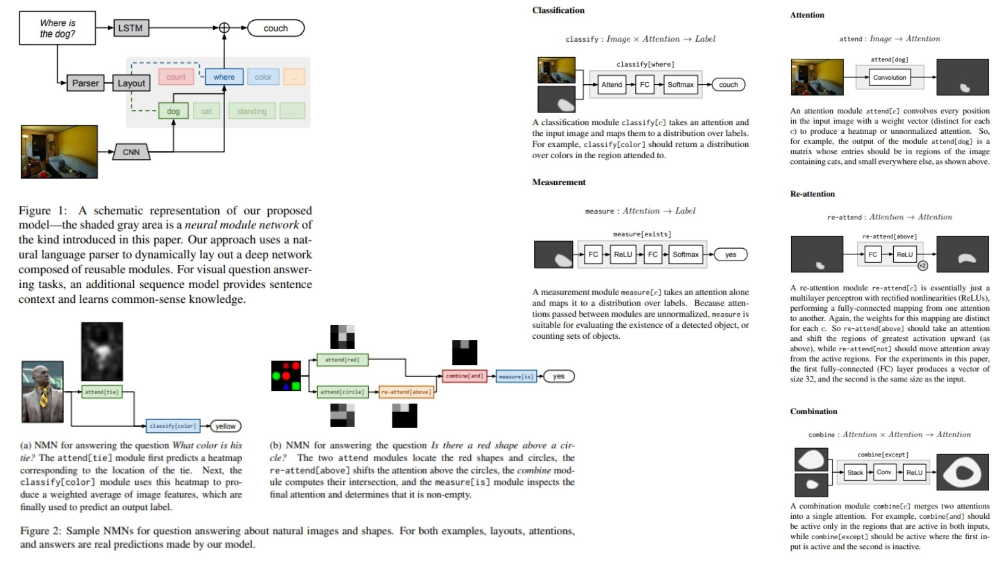

# 🎨 NMN-VQA-Replication — Neural Module Networks for Visual Question Answering

This repository provides a **PyTorch-based replication** of  
**Neural Module Networks (NMN) for Visual Question Answering — Andreas et al., 2016/2017**.

The focus is on **faithfully reproducing the NMN pipeline**  
with a clean, modular, and research-oriented implementation.

- Decomposes **questions into linguistic substructures** 📝  
- Dynamically assembles **neural modules** for reasoning 🧩  
- Integrates **visual features + attention + text context** 🎤  

**Paper reference:** [Deep Compositional Question Answering with Neural Module Networks — Andreas et al., 2016](https://arxiv.org/abs/1511.02799) 📄

---

## 🧠 Overview — NMN Visual Question Answering Pipeline



The core idea:

> Intelligence emerges from **compositional reasoning over image and question**, not from monolithic predictions.

Instead of directly mapping  
$(image, question) \rightarrow answer$,  
the model is structured as:

$$
x \;,\; w \;\longrightarrow\; \text{NMN Layout} \;\longrightarrow\; \{modules\} \;\longrightarrow\; y
$$

Where:  
- $x$ = input image  
- $w$ = question string  
- $modules$ = reusable neural modules (attend, re-attend, combine, classify, measure)  
- $y$ = predicted answer  

The model dynamically composes modules based on **question structure**, then fuses outputs with an optional LSTM question encoder.

---

## 👁 Vision Encoder — Image to Attention Maps

Given an input image $x$, a CNN backbone produces a spatial feature map:

$$F(x) \in \mathbb{R}^{H \times W \times C}$$

Attention modules (attend[object], attend[color], etc.) produce **unnormalized heatmaps**:

```math
A_c = attend[c](F(x))
```

Where $c$ is the concept (dog, red, tie, etc.).  

Higher-level re-attend and combine modules allow **spatial shifts** and **logical composition**:

```math
A' = re\_attend[above](A) \quad,\quad A'' = combine[and](A_1, A_2)
```

---

## 🎯 Classification & Measurement — Final Answer

Classification modules map attention maps to label distributions:

$$
p_\text{class} = classify[c](F(x), A)
$$

Measurement modules operate on attention maps alone (e.g., yes/no, count):

```math
p_\text{measure} = measure[c](A)
```

The optional LSTM question encoder produces a **textual context distribution**:

$$
p_\text{LSTM} = LSTM(w)
$$

Final prediction is a **fusion of NMN and LSTM outputs**:

$$
p_\text{final}(y) \propto \sqrt{p_\text{NMN}(y) \cdot p_\text{LSTM}(y)}
$$

---

## 🧩 What the Model Learns

- Visual object detection via attention  
- Compositional reasoning over objects and attributes  
- Spatial and logical relationships  
- Attribute binding & scene structure  
- Common-sense knowledge via LSTM fusion  

---

## 📦 Repository Structure

```bash
NMN-VQA-Replication/
├── src/
│   ├── backbone/
│   │   └── cnn_encoder.py         # Image → feature map
│   │
│   ├── modules/
│   │   ├── attend.py              # Image → Attention (attend[dog], attend[red], etc.)
│   │   ├── re_attend.py           # Attention → Attention (re-attend[above], re-attend[not])
│   │   ├── combine.py             # Attention × Attention → Attention
│   │   ├── classify.py            # Image × Attention → Label (classify[color], classify[where])
│   │   └── measure.py             # Attention → Label (yes/no, count)
│   │
│   ├── layout/
│   │   └── parser_to_layout.py    # Question string → NMN network layout
│   │
│   ├── model/
│   │   └── nmn_pipeline.py        # Image + Question → NMN modules → Final Answer
│   │
│   ├── question_encoder/
│   │   └── lstm_encoder.py        # Optional: LSTM question encoder for context & common sense
│   │
│   ├── loss/
│   │   └── loss.py                # VQA-specific loss (cross-entropy)
│   │
│   └── config.py
│
├── images/
│   └── figmix.jpg               
│
├── requirements.txt
└── README.md
```
---


## 🔗 Feedback

For questions or feedback, contact: [barkin.adiguzel@gmail.com](mailto:barkin.adiguzel@gmail.com)
